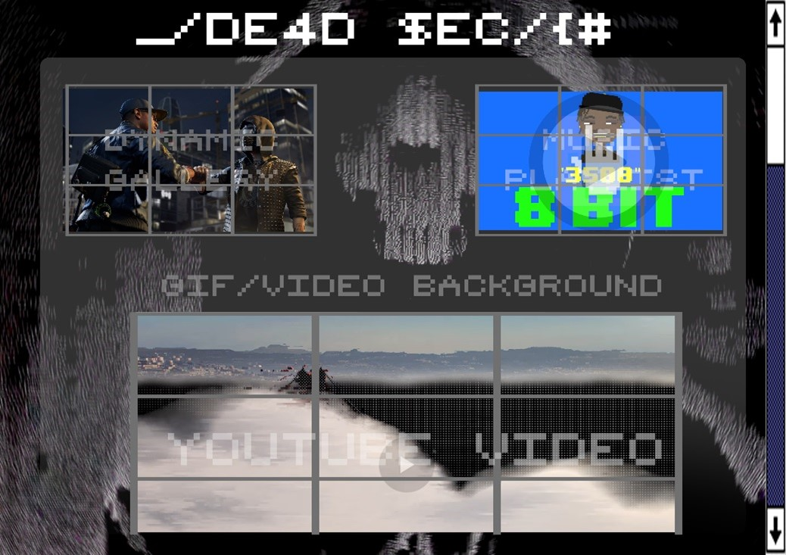
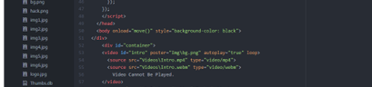
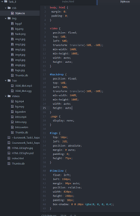
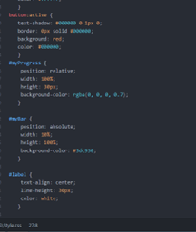

Access Site: <a href="https://nadocodes.github.io/watchdogs2-fanpage/">Watch Dogs 2 Fanpage!</a>
 

# Webpage Report

## 1.  Introduction:

The final part of the first coursework task was a fairly open piece of
production. Students were given the task to produce a single webpage or
a web app of their choice. The task instructed students to thoroughly
focus on three parts of the product: the design, the production, and an
evaluation. There were also seven items of coding that students had to
demonstrate through the creation of their page. This pair decided to
create their webpage based on a recent video game, the game is all about
hacking and sneaking gave the students a variety of ideas in order to
produce a professional, conventional website fan page.

## 2.  Pre -- Production (Design)

Research and planning is the most vital phase within
the production, that's where all of the ideas and design factors are
gathered up and made visually clear through rough sketches as well as
editing software programs. A plan was put in place which recorded
exactly what would go where around the page, also how everything pieces
together giving the overall impression of the page's appearance. Figure
one demonstrates this group's planning sheet. The overall outcome of the
plan signified the aesthetics of how the page was going to look. The
general conventions that this particular production would focus on would
revolve around the aspect of hacking and scripting, demonstrate through
the use of colour where the conventional de-statured darker colours
would be present however they would juxtapose with the brighter warm
colours in order to portray the aspect of modern hacking. The typeface
was decided to have the look of an "8-bit" font as that would portray
the typical hacking language and style.

Sketching an overall design is another key part of planning as it
provides a clear visual representation of how everything would piece
together, thus becoming helpful later on during the production stage as
it would provide something to refer back to, preventing drifting off and
allowing the creator to stick to their original and refined idea. Figure
two and there demonstrate the two designs that were sketched out during
their planning meetings, theses rough designs were shown to some target
audience and from their feedback, a final design was decided upon
and furthermore created with colour as well as aesthetics by the use of
Photoshop. This is shown in figure 4. The completely edited and coloured
image of the design properly showed where everything that needed to be
included in the production stage would be located on the page as well as
it portrayed how everything would look once it's pieced together.
Looking back at this once the production had been finished, the creators
stuck to this design however some things were changed in order to give
the webpage a better flow and an overall more professional look.

## 3.  Production

This particular production was created by using Atom as it is a program
with a simple user interface due to having a variety of colours that
provide a clear distinction between elements. One of the focuses of the
main task was to demonstrate knowledge of seven key parts of coding.
This webpage demonstrates all of those functions in a variety of ways.

Firstly embedding media in a piece of work is a vital part in order to
make anything look eye-catching and interesting as it would persuade the
users of the webpage to stay on and explore the included media. Bringing
in third-party content allows for a more professional and distinct look
to the page as a whole. This webpage demonstrates the use of a variety
of media content that had been included through different sets of code
such as \<iframe\> to embed an external video from Youtube, "\<video\>",
"\<audio\>" and "\" tags were used to display internal content
downloaded prior to the production. The entire production reflects this
because there is a dynamic gallery formed from internal pictures, as
well as a video background, using at least two formats. If the user did
not have one format, the other would replace the main one. The use of a
gif for the background was also important regarding the amount of
content the user would have to load, as the file size is significantly
lower than having a looping video. Figure 5 demonstrates how this has
been done.

Incorporating Media

Having all the files well organized helps drastically during production
as it provides a clear knowledge of where things are as well as an ease
of finding a particular object that needs to be included at a given time
during production. All images, videos and sounds were moved to specific
folders in order for everything to be well organized. This relates to
the use of an external CSS file that was linked to the HTML during this
production. This sort of organization allowed the creators to apply
style rules to objects in the HTML through usage of CSS selectors in
order to add colour, font as well as the position of objects within the
page itself. This is demonstrated in this production as figure 6 shows a
part of the separate CSS file used to create the aesthetics of the page,
as well as on the left-hand side the file organization is also shown.

File Organization & Separate CSS File

In order to make the production look as professional as it can be an
advanced layout had to be followed in order to position elements
appropriately. The use of JavaScript, jQuery and CSS were heavily
implemented throughout the layout of the webpage. As the webpage itself
includes an introduction it meant that the page itself had to be
separated into two parts, the first part being what is being shown
during the onload process and the second and main part which applies the
appearance of the gif background along with the \<article\> tag which
included the main contents within it. The use of CSS was vital here due
to its capabilities of handling style rules which apply to individual
tags as well as allowing the use of an element\>element Selector meaning
that rules were only applied to a certain element if it is present
within another element. A clear example of this is applying a style rule
to a \<p\> tag through the \<section\> being the parent.

An objective of the task was to properly incorporate third-party CSS
within the production as it is a vital skill that expands the creator's
ideas as they can be influenced by other creations across the web. This
particular webpage includes a minim amount of third-party CSS, allowing
the students to use their ideas and knowledge rather than somebody
else's. A button generator website such as the one referenced at the
bottom of the page allows users to create a design for a button they can
potentially use on their page. The website allows users to manipulate
the shape, colour, etc. of a particular button, once completed the page
provides CSS as well as HTML code that can be copied to the webpage,
thus creating a third-party CSS.

CSS animations add interactivity to any page producing a more
professional-looking piece of work, these animations can be simple, yet
highly effective. This production demonstrates the use of CSS animations
due to the loading progress bar at the top of the page, this bar starts
to run as soon as the page is loaded. Figure 8 demonstrates the CSS
rules that were included in order for this animation to run.

Progress Bar -- CSS Animation

## 4.  Evaluation / Conclusion

Evaluating a finalized piece of work provides the ability for the
creators to look back on what they've done, demonstrate an understanding
of their strengths as well as reflect on problems that occurred during
the production so that weaknesses and areas of improvement can be
identified. A strong evaluation needs to be honest and critical.

Overall the created page is complex in the sense that it uses a lot of
JavaScript in order to give the page its appeal. The main challenge that
was faced during the production was to create the illusion that the user
is transitioning from an intro page to the main page, however encoding
JavaScript in a particular way, everything happens within one webpage.
By hiding one division of contents and displaying the other, this
illusion works perfectly as the transition was seamless. The script
coding included introduces a set of events that string together through
a variety of functions, the button would only appear if the loading
bar's value was set to '100' working perfectly with the move function
which works to increase the value of the bar for a short duration. The
button itself loads into the page with the style rule "display:none"
meaning the button is hidden, a "show()" function was used in order to
replace the style rule with "display:block/flex" thus allowing for the
button to appear. The same process was used over and over as the button
is clicked in order to display the other part of the page, a simple
tweak was also put in place in order to hide the which was by using the
function ".hide()" which is highly self-explanatory. After solving and
practicing issues around this, it became a lot more apparent allowing
for the ability to experiment with JavaScript and the code as a whole
while having a higher amount of knowledge surrounding the way it all
works together.

Constructive criticism is a key part of making any production better,
during the production stage this webpage received a lot of peer feedback
where comments about the colours and font were made. Originally the
colour scheme for the production was going to include a bright green
colour for the text, the feedback however suggests that a bright pink
would be better. Upon the trial the new colour looked better and more
intervening, thus meaning that constructive feedback made this
production better.

## 5.  References

<http://css3buttongenerator.com/> - Website used for the creation of
button

<https://www.youtube.com/watch?v=2GIVVsTKTLg> -- Trailer used for intro
page and background

<https://www.youtube.com/watch?v=2GIVVsTKTLg> -- Trailer used on the
page

<https://www.youtube.com/watch?v=gEoN0-NdiLw> -- Song used for
background
